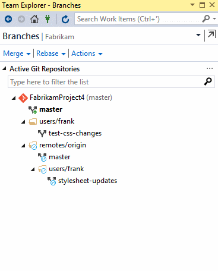
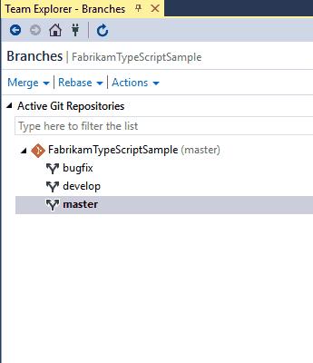

# Create work in branches  

Git branches aren't much more than a small reference that keeps an exact history of commits, so they are cheap to create.
[Committing](commits.md) changes to a branch will not affect other branches, and you can share branches with others without having to merge the changes into the main project.
Create new branches to isolate changes for a feature or a bug fix from your master branch and other work. 

Since the branches are lightweight, switching between branches is quick and easy. 
Git does not create multiple copies of your source when working with branches&mdash;it uses the history information stored in commits to recreate the files on a branch when you start working on it.
Your [Git workflow]([gitworkflow.md](https://docs.microsoft.com/en-us/azure/devops/repos/git/gitworkflow?view=azure-devops)) should create and use branches for managing features and bug fixes.
The rest of the Git workflow, such as [sharing code](pushing.md) and [reviewing code with pull requests](pullrequest.md) all work through branches.
Isolating work in branches makes it simple to change what you are working on by changing your current branch.

In this tutorial you learn:

> * How are Git branches created?
> * How to create a branch
> * How to delete a branch
> * How to use branches

## How are Git branches created?

Create branches using the `branch` command. `Branch` creates a reference in Git for the new branch and a pointer back to the parent commit so Git can keep a history of changes as you add commits to the branch. 
When you are working with a branch that someone else shared, Git keeps an upstream tracking relationship to associate the branch on the local repo with the corresponding branch on the remote repo.
This makes it simple to sync changes with others using [push](pushing.md) and [pull](pulling.md).


In this image, a new branch is created from the main branch. Work continues on both branches and commits are added to both branches. 

Git always adds new commits to the current local branch. Check what branch you are working on before you commit so that you don't commit changes to the wrong branch. 
Swap between local branches using the `checkout` command. Git will change the files on your computer to match the latest commit on the checked out branch.
When your work in the branch is ready to share with the rest of the team, you [push](pushing.md) the changes to update the remote branch. 

A common mistake is to make some changes and `commit` them, realize you are on an incorrect branch, then `checkout` to the correct branch.
Your most recent changes will no longer be on the filesystem since each branch has its own version of code. 
Git will bring the state of the files back to the last commit on the branch you swapped into, not the previous branch where you made your changes. 
You'll need to either [cherry-pick]([cherry-pick.md](https://docs.microsoft.com/en-us/azure/devops/repos/git/cherry-pick?view=azure-devops)) the commits from the branch or [merge](pulling.md#update-branches-with-merge) the changes into the correct branch.

## Create a branch

### Lab Exercise Part 1:

1. Open up Team Explorer and go to the **Branches** view.
2. Right-click the parent branch (usually `master`) to base your changes and choose **New Local Branch From...**. 
3. Supply a branch name in the required field and click **Create Branch**. Visual Studio automatically performs a `checkout` to the newly created branch.


Example: 
    
   

#### Command Line -- FYI
Use the `branch` command to create the branch and `checkout` to swap to that branch.

```
git branch feature1
git checkout feature1
```

* * *
## Delete a branch

> [!NOTE] 
> Deleting a branch in your local repo doesn't remove the branch on the remote.

### Lab Exercises -- Part 2:


1. Open up Team Explorer and go to the **Branches** view.
2. Create a new branch (you can call it 'Deleteme').
3. Checkout the master branch as you can't delete the branch you are currently working in.  (eg, to check out the **master** branch, right click on it and select 'checkout')
4. Right-click the branch name ('delreteme') and select **Delete**. If you have unpublished changes, Visual Studio will ask and make sure you want to delete the branch so you don't possibly lose work.

Example:



You can delete a remote branch using the same method - locate the tree for the remote in Team Explorer's **Branches** view (such as `remotes/origin`), right-click and select **Delete**.

#### [Command Line -- FYI]
Delete a local branch using `git branch -d` while checked out to a different branch.

```
git branch -d <branch_name>
```

Deleting a remote branch requires use of the `git push` command using the `--delete` option.

```
git push origin --delete <branch_name>
```

* * *
## Use branches to manage development

Git keeps track of which branch you are working on and makes sure that when you `checkout` a branch your files match the most recent commit on the branch. 
Branches let you work with multiple versions of the source code in the same local Git repository at the same time. 
Tell Git which branch you want to work on with `checkout`, and Git takes care of setting the right file versions for that branch.

You shouldn't need more than one repo on your system when you use branches to isolate your work. 
Set up your development environment one time after you [clone](clone.md), and then use Git branches to swap between feature work and bug fixing. 

## Next steps

> [Share code with push](pushing.md)