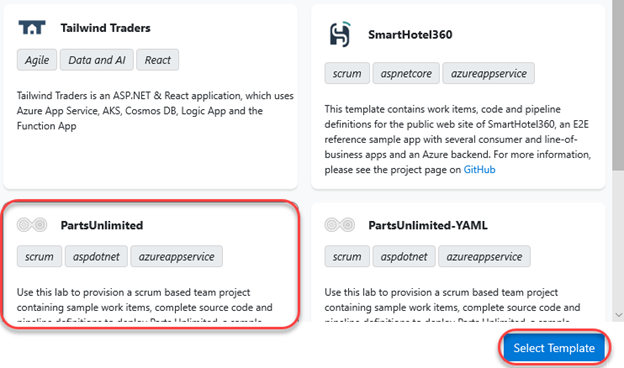

## Overview ##
Certain Azure DevOps labs require a preconfigured **Parts Unlimited** team project. This document outlines the required steps to set up the required data.

### Task 0: Choose your user ###
For this lab, you will use a test account.  Select one of the following:
- [ ] AlexW@sbsgitdemo.OnMicrosoft.com
- [ ] AllanD@sbsgitdemo.OnMicrosoft.com
- [ ] DiegoS@sbsgitdemo.OnMicrosoft.com
- [ ] IsaiahL@sbsgitdemo.OnMicrosoft.com
- [ ] JoniS@sbsgitdemo.OnMicrosoft.com
- [ ] LynneR@sbsgitdemo.OnMicrosoft.com
- [ ] MeganB@sbsgitdemo.OnMicrosoft.com
- [ ] NestorW@sbsgitdemo.OnMicrosoft.com
- [ ] PattiF@sbsgitdemo.OnMicrosoft.com

Log into azure devops to create your organization  https://devops.azure.com

### Task 1: Configuring the Parts Unlimited team project ###

1. Navigate to [https://azuredevopsdemogenerator.azurewebsites.net](https://azuredevopsdemogenerator.azurewebsites.net/). This utility site will automate the process of creating a new Azure DevOps project within your account that is prepopulated with content (work items, repos, etc.) required for the lab. For more information on the site, please see [https://docs.microsoft.com/en-us/azure/devops/demo-gen](https://docs.microsoft.com/en-us/azure/devops/demo-gen).

1. Sign in using the Microsoft account associated with your Azure DevOps subscription.

    

1. **Accept** the permission requests for accessing your subscription.

1. Select your Azure DevOps organization and enter the project name **"Parts Unlimited"**. Click **Choose Template**.

    

1. Select the **PartsUnlimited** template and click **Select Template**.

    

1. Click **Create Project** and wait for the process to complete.

    

### Task 2: Configuring the Parts Unlimited solution in Visual Studio ###

1. Navigate to your Azure DevOps team project for **Parts Unlimited** by clicking on the 'Navigate' button. The URL will be something like [https://dev.azure.com/YOURACCOUNT/Parts%20Unlimited](https://dev.azure.com/YOURACCOUNT/Parts Unlimited).

2. Navigate to the **Repos** hub.

    

3. Click **Clone** and select **Clone in Visual Studio**.

    

4. Follow the workflow to clone and configure the project in Visual Studio. Click **Connect** to copy the repo locally.

    

5. From **Team Explorer**, double-click **PartsUnlimited.sln** from the **Solutions** section to open the solution. You can ignore warnings about unsupported project types.

    

6. Leave Visual Studio open for use in your lab.

