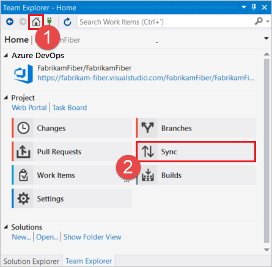
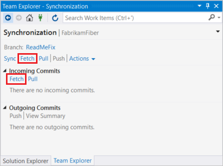
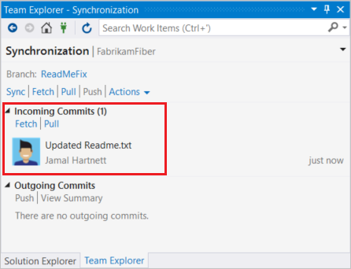
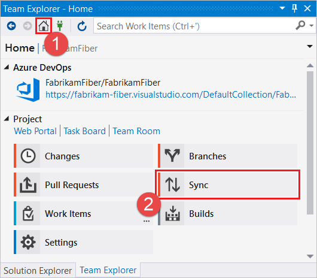
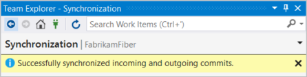
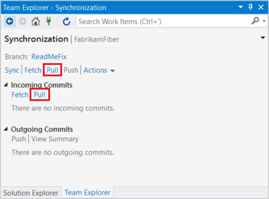
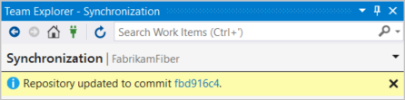

# Update code with fetch and pull

Update the code in your local repo with the changes from other members of your team using the following commands:

- `fetch` , which downloads the changes from your remote repo but doesn't apply them to your code.
- `merge` , which applies changes taken from `fetch` to a branch on your local repo.
- `pull` , which is a combined command that does a `fetch` and then a `merge`.

In this tutorial you learn how to:

> * Download changes with fetch
> * Update branches with merge
> * Fetch and merge with pull
> * Update your local branch with the latest changes from master

If there's a merge conflict between a commit you haven't [pushed](pushing.md) yet and a commit you're merging or pulling, [resolve those conflicts](merging.md) before you finish updating your code.

## Download changes with fetch

You download changes to your local branch from the remote through `fetch`. `Fetch` asks the remote repo for all commits and new branches that others have pushed but you don't have and downloads them into your repo, creating local branches as needed.

`Fetch` doesn't merge any changes into your local branches. It only downloads the new commits for your review.

>[!TIP]
>To help keep your branches list clean and up to date, configure Git to prune remote branches during fetch. You can configure this setting from the [command line]([git-config.md?tabs=command-line#prune-remote-branches-during-fetch](https://docs.microsoft.com/en-us/azure/devops/repos/git/git-config?tabs=command-line&view=azure-devops#prune-remote-branches-during-fetch)) or from within [Visual Studio]([git-config.md?tabs=visual-studio#prune-remote-branches-during-fetch](https://docs.microsoft.com/en-us/azure/devops/repos/git/git-config?tabs=visual-studio&view=azure-devops#prune-remote-branches-during-fetch)).

### Lab - Exercise 1

Visual Studio uses the **Sync** view in Team Explorer to `fetch` changes.
Changes downloaded by `fetch` aren't applied until you **Pull** or **Sync** the changes.

1. First, let's make some changes on the server to simulate a change made by a team member.  From your browser, navigate to "Repos -> Files", then select the `README.MD` file and click 'Edit'.  Make a change to this file and press 'Commit', then 'Commit' again to save it.

1. Back in Visual Studio, select the **Home** button, select 'Branches', then make sure the Master branch is checked out.
   
2. In Team Explorer, select the **Home** button and choose **Sync**.

   

3. In **Synchronization**, select **Fetch** to update the incoming commits list.

   

   There are two **Fetch** links, one near the top and one in the **Incoming Commits** section. You can use either one.

4. Review the results of the fetch operation in under **Incoming Commits**.

   

#### [Command Line -- FYI]

Run the `git fetch` command from the command line to download changes to your local branch.

```cmd
git fetch
```

After you run `git fetch`, you'll see results similar to the following example:

```cmd
remote: Found 3 objects to send. (9 ms)
Unpacking objects: 100% (3/3), done.
   e2ccee6..55b26a5  feature1   -> origin/feature1
```

* * *

## Update branches with merge

Apply changes downloaded through `fetch` using the `merge` command. `Merge` takes the commits retrieved from `fetch` and tries to add them to your local branch.
The merge keeps the commit history of your local changes. When you share your branch with [push](pushing.md), Git knows how others should merge your changes.

The challenge with `merge` is when a commit taken from `fetch` conflicts with an existing unpushed commit on your branch.
Git is generally very smart about resolving merge conflicts automatically, but sometimes you must [resolve merge conflicts manually](merging.md) and complete the merge with a new `merge` commit.

#### Lab Exercise 2

Team Explorer merges when you do a **Pull** or a **Sync** from the **Changes** view.

**Sync** is a combined operation of pulling remote changes and then pushing local ones. This operation synchronizes the commits on the local and remote branch.

1. In Team Explorer, select the **Home** button and choose **Sync**.

   

2. In **Synchronization**, select **Sync**.

   

3. Review the confirmation message when the sync operation completes.

   

#### [Command Line -- FYI]

Running `merge` without any flags or parameters adds the commits downloaded from `fetch` into the local branch.
Git adds a merge commit if you have any conflicts. This merge commit has two parent commits, one for each branch, and contains the changes committed to resolve the conflicts between branches.

```cmd
git merge
```

<pre>
<font color="#b5bd68">Updating e2ccee6..55b26a5
 1 file changed, 1 insertion(+)</font>
</pre>

Specify the `--no-commit` parameter to merge without committing. The command attempts to merge but not commit the final changes. This parameter gives you a chance to inspect the changed files before finalizing the merge with a commit.

* * *
<a name="pull"></a>  

## Fetch and merge with pull

`Pull` does a `fetch` and then a `merge` to download the commits and update your local branch in one command instead of two.
Use `pull` to make your branch current with the remote when you aren't worried about reviewing the changes before merging them into your own branch.

#### Lab Exercise 3

Open the Team Explorer and open the Sync view. Then click the **Pull** link under **Incoming Commits** to `pull` remote changes and merge them into your local branch. Pulling
updates files in your open project, so make sure to [commit your changes](commits.md) before pulling.

1. First, let's make some changes on the server to simulate a change made by a team member.  From your browser, navigate to "Repos -> Files", then select the `README.MD` file and click 'Edit'.  Make another change to this file and press 'Commit', then 'Commit' again to save it.

1. In Visual Studio, in Team Explorer, select the **Home** button and choose **Sync**.

   

1. In **Synchronization**, choose **Pull** to fetch remote changes and merge them into your local branch.

   

   There are two **Pull** links, one near the top and one in the **Incoming Commits** section. You can use either one.

1. Review the confirmation message when the pull operation completes.

   

#### Command Line - FYI

`git pull` without any options does a `fetch` of the changes you don't have from `origin` and will `merge` the changes for your current branch.

```cmd
git pull
```

<pre style="color:white;background-color:black;font-family:Consolas,Courier,monospace;padding:10px">
<font color="#b5bd68">Updating 55b26a5..e7926cd
 1 file changed, 2 insertions(+), 1 deletion(-)</font>
</pre>

Pull a remote branch into a local one by passing remote branch information into `pull`:

```cmd
git pull origin users/frank/bugfix
```

A `pull` command is a useful way to directly merge the work from remote branch into your local branch.

* * *

* * *

## Next steps

> [Review Code with Pull Requests](pullrequest.md)

